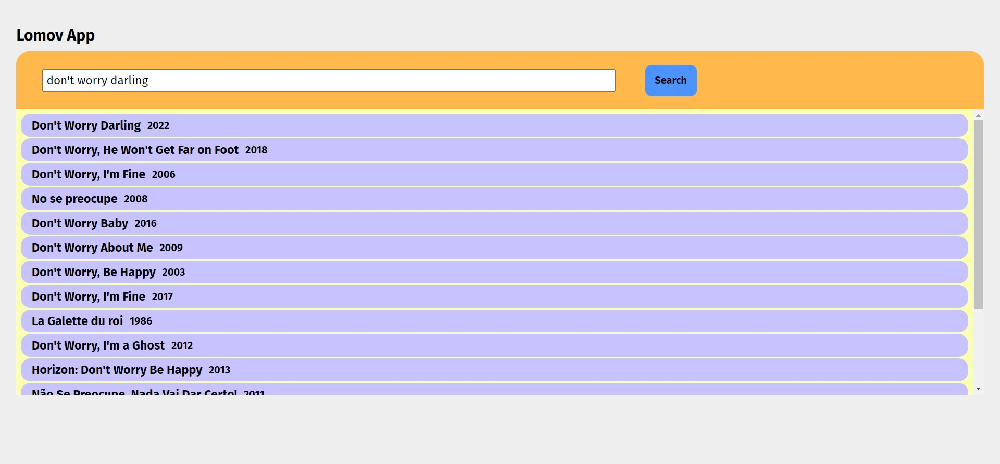
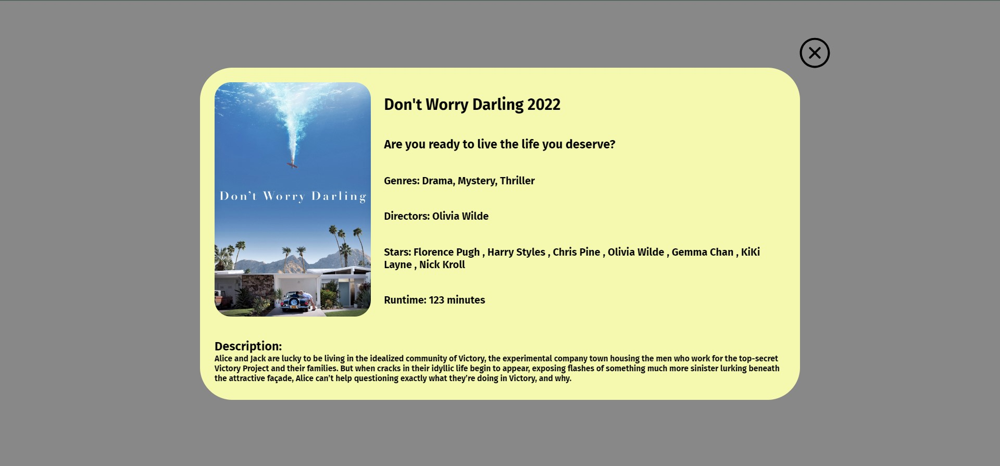

# Lomov - Love the Movies

#### This app is writen by React js.

---

_First I need to appreciate `Streaming Availability` by `Movie of the Night` for preparing the free server, So i could use their huge database of movies._

&nbsp;

### I Love movies and nobody can Stop me from being such a psycho :)

#### So it was the time to show my love by making this fantastic app. It provides you a huge resource of movies to search in and collect lots of data about it.

&nbsp;

##### Let's analyze the app and get more data about it.

---

## Store

#### This app use `Redux` for managing states. we use it for three purpose:

- Search result: When we click the Button to search the we have been entered, the result will come back in array mode. App first saves the array in `Redux` and then assign it to `SearchResult` file. **This part will be managed by `SearchSlice` file.**
- Selected movie: When the result has been shown and you click the card, which contain the movie you want, App save the selected movie in `Redux` as an object and use it anytime you want. **`MovieSlice` will manage it.**
- Show selected movie: The final one is so easy and simple. we just manage the visibility of our modal by this. It's boolean and **managed by `MovieDetailSlice` file.**

---

## UI

#### This app has a very simple ui. It made by two main part in first page. the first part contain an Input and a Button to search the movie, you have entered in Input part. When you enter the name and click the Button, the result will be shown in the below part. The Above part is `SearchMovie` and below part is `SearchResult`. each result movie will be shown in `SearchResultCard` file.



&nbsp;

#### When you click one of the cards, the chosen movie will be shown in new view. The app shows the movie in a modal. It contains the below data of a movie:

- Name
- Year
- Tagline
- Genres
- Directors
- Stars
- Runtime
- Overview



**Desktop and mobile views are different.**
&nbsp;

---

## How to run:

&nbsp;

### 1. First enter the main folder:

```
cd todolist
```

&nbsp;

### 2. Then install `node modules` folder:

```
npm install
```

&nbsp;

### 3. Finally run the app by this command:

```
npm start
```

&nbsp;

---

**_I Will be So happy if you give me feedback by this project :)_**
